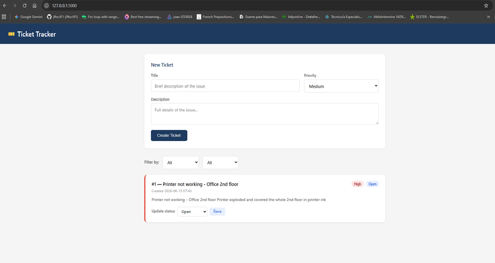

# 🎫 Ticket Tracker

A web-based IT support ticket tracking application built with Python and Flask.
Users can create, manage, and filter support tickets by priority and status.

## 📸 Screenshot

> 

## ✨ Features

- Create tickets with title, description, and priority level (High / Medium / Low)
- View all tickets in a clean, colour-coded list
- Update ticket status (Open → In Progress → Resolved)
- Filter tickets by status and priority
- Data saved automatically to a local JSON file

## 🛠️ Built With

- Python 3.14
- Flask 3.1.3
- HTML & CSS
- JSON for data storage

## 🚀 Installation

1. Clone the repository
2. Install dependencies
3. Run the app
4. Open your browser and go to:http://127.0.0.1:5000

## 👤 Author

**João** — aspiring IT professional based in Trier, Germany.
Background in multilingual customer support (English, German, Portuguese, Spanish).
Currently building a portfolio of Python and web projects.

GitHub: [@jfhcc91](https://github.com/jfhcc91)